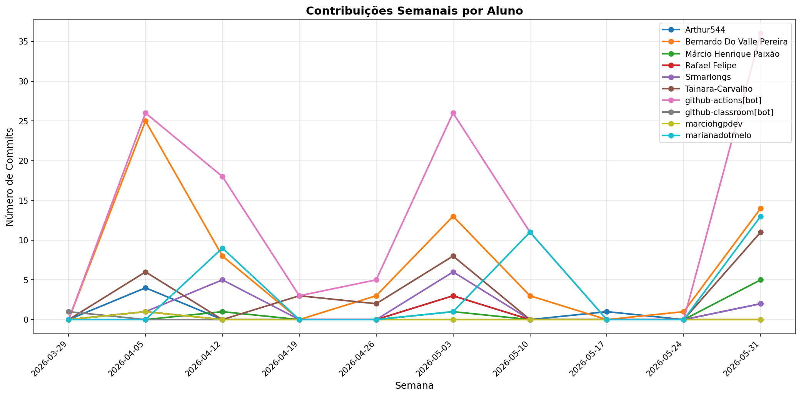

# 📊 Relatório de Contribuições do Projeto

**Última atualização:** 07/06/2026 21:12

---

## 📈 Resumo Geral de Contribuições

| Aluno                     |   Commits |   Linhas+ |   Linhas- |   Arquivos |   Docs Commits |   Docs Arquivos |
|---------------------------|-----------|-----------|-----------|------------|----------------|-----------------|
| Arthur544                 |        10 |      1017 |        11 |          8 |              5 |               2 |
| Bernardo Do Valle Pereira |        67 |      7587 |      4278 |         58 |             45 |               3 |
| Márcio Henrique Paixão    |         7 |       208 |        28 |          7 |              3 |               1 |
| Rafael Felipe             |         4 |       249 |         2 |          4 |              2 |               1 |
| Srmarlongs                |        14 |      1575 |        11 |         13 |             10 |               2 |
| Tainara-Carvalho          |        30 |       785 |       172 |          8 |             27 |               2 |
| github-actions[bot]       |       125 |       686 |       616 |          3 |            125 |               1 |
| github-classroom[bot]     |         1 |       774 |         0 |         19 |              1 |               3 |
| marciohgpdev              |         1 |         5 |         5 |          1 |              1 |               1 |
| marianadotmelo            |        34 |       834 |       439 |         14 |             19 |               3 |

## 📅 Contribuições Semanais (Todo o Semestre)

**2026-05-31**: Arthur544: 2, Bernardo Do Valle Pereira: 14, Márcio Henrique Paixão: 5, Srmarlongs: 2, Tainara-Carvalho: 11, github-actions[bot]: 36, marianadotmelo: 13

**2026-05-24**: Bernardo Do Valle Pereira: 1

**2026-05-17**: Arthur544: 1

**2026-05-10**: Bernardo Do Valle Pereira: 3, github-actions[bot]: 11, marianadotmelo: 11

**2026-05-03**: Arthur544: 3, Bernardo Do Valle Pereira: 13, Márcio Henrique Paixão: 1, Rafael Felipe: 3, Srmarlongs: 6, Tainara-Carvalho: 8, github-actions[bot]: 26, marianadotmelo: 1

**2026-04-26**: Bernardo Do Valle Pereira: 3, Tainara-Carvalho: 2, github-actions[bot]: 5

**2026-04-19**: Tainara-Carvalho: 3, github-actions[bot]: 3

**2026-04-12**: Bernardo Do Valle Pereira: 8, Márcio Henrique Paixão: 1, Srmarlongs: 5, github-actions[bot]: 18, marianadotmelo: 9

**2026-04-05**: Arthur544: 4, Bernardo Do Valle Pereira: 25, Rafael Felipe: 1, Srmarlongs: 1, Tainara-Carvalho: 6, github-actions[bot]: 26, marciohgpdev: 1

**2026-03-29**: github-classroom[bot]: 1

## 📊 Visualização Gráfica

## ℹ️ Observações

- **Commits**: Número total de commits realizados

- **Linhas+**: Linhas de código adicionadas

- **Linhas-**: Linhas de código removidas

- **Arquivos**: Número de arquivos únicos modificados

- **Docs Commits**: Commits em arquivos de documentação

- **Docs Arquivos**: Arquivos de documentação modificados

---

*Relatório gerado automaticamente via GitHub Actions*
